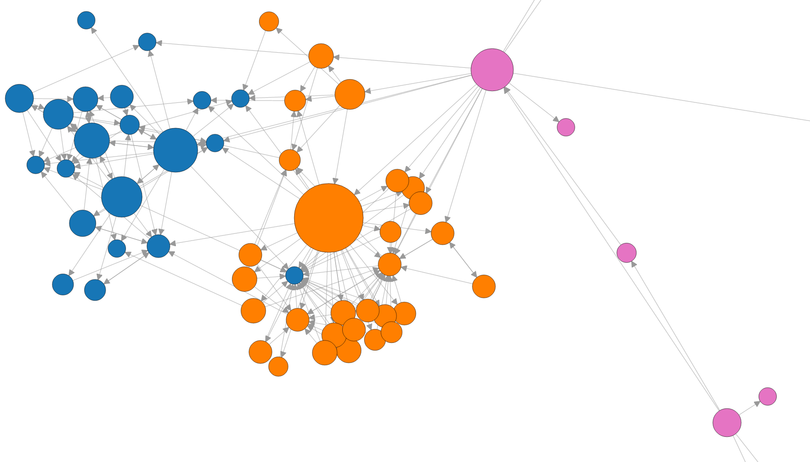

Oak
===

A tool that parses bytecode in the classpath and builds a graph of dependencies between classes.
Just for fun! *Requires Java 8.*



Inspired by [**PaulTaykalo's**](https://github.com/PaulTaykalo) [objc-dependency-visualizer](https://github.com/PaulTaykalo/objc-dependency-visualizer).
And many thanks to an awesome [d3js](http://d3js.org/) library!

How to use
----------

**Manual way**

```bash
curl -L https://github.com/roman-mazur/oak/releases/download/v0.1.1/oak-cli.jar > oak-cli.jar
java -jar oak-cli.jar -cp path/to/your.jar:and/or/library.jar:or/classes/dir -f html -o deps-report
open deps-report/index.html
```
Use `-e` parameter to exclude libraries from your graph (using regexps)
```
-e android.+ -e rx.+
```
or define terminal nodes with `-t` parameter:
```
-t retrofit.+
```

**Gradle plugin**
TODO

Share your graphs with [#javadv](https://twitter.com/hashtag/javadv) hash!
